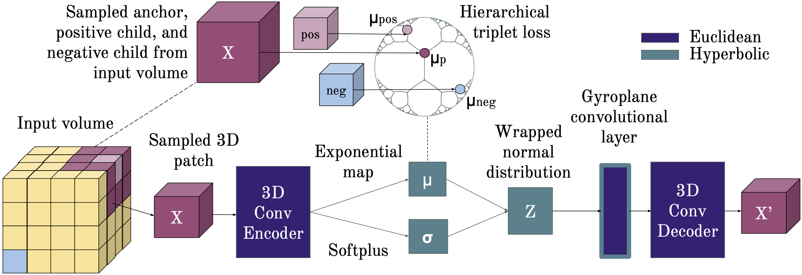

# [Capturing implicit hierarchical structure in 3D biomedical images with self-supervised hyperbolic representations](https://arxiv.org/pdf/2012.01644.pdf)



Code for reproducing the experiments in the paper:
```
@inproceedings{mathieu2019poincare,
  title={Capturing implicit hierarchical structure in 3D biomedical images with self-supervised hyperbolic representations},
  author={Hsu, Joy and Gu, Jeffrey and Wu, Gong Her and Chiu, Wah and Yeung, Serena},
  booktitle={Advances in Neural Information Processing Systems},
  year={2021}
}
```

## Prerequisites
`pip install -r -U requirements.txt` or `python3 setup.py install --user`

## Data
The simple synthetic dataset can be downloaded from Google Drive [here](https://drive.google.com/file/d/1mdRuSkXmTof9vq62FSmoZXneUme_97dc/view?usp=sharing) and the irregular synthetic dataset can be downloaded [here](https://drive.google.com/file/d/1XGx8GQlNGCStmxjYatWGBGAW25e2zxTn/view?usp=sharing). Please place the datasets in the `/data` folder. 

## Models

### VAE (`--manifold Euclidean`):
- Prior distribution (`--prior`): `Normal` (`WrappedNormal` is theoretically equivalent)
- Posterior distribution (`--posterior`): `Normal`  (`WrappedNormal` is theoretically equivalent)
- Decoder architecture (`--dec`): `LinearConv` (3D Conv) 
- Encoder architecture (`--enc`): `LinearConv` (3D Conv)
- Triplet loss (`triplet-loss`): Whether to use hierarchical triplet loss
    - `--triplet-weight`: how much to weight triplet loss relative to the ELBO loss
    
### PVAE (`--manifold PoincareBall`):
- Curvature (`--c`): 1.0
- Prior distribution (`--prior`): `WrappedNormal`
- Posterior distribution (`--posterior`): `WrappedNormal`
- Decoder architecture (`--dec`):
    - `WrappedConv`: 3D Convolutional decoder
    - `GyroConv`: 3D Convolutional decoder with gyroplane convolution as first layer
- Encoder architecture (`--enc`): `WrappedConv` (3D Conv)
- Triplet loss (`triplet-loss`): Whether to use hierarchical triplet loss
    - `--triplet-weight`: how much to weight triplet loss relative to the (Riemannian) ELBO loss (see Mathieu et al 2019)

## Run experiments

### Synthetic dataset
Euclidean:
```
python3 pvae/main.py --model toy_sampled_triplet --manifold Euclidean --latent-dim 2 --hidden-dim 300 --prior Normal --posterior Normal --dec LinearConv --enc LinearConv --lr 5e-5 --epochs 8 --save-freq 1 --batch-size 128 --iwae-samples 5000 --skip-test --name sup_euc_n0 --triplet-loss --triplet-loss-dist --triplet-weight 1e3 --K 8 --save-dir /pasteur/results/jeff-results/capturing-implicit-hierarchical-structure/experiments
```
Hyperbolic:
```
python3 pvae/main.py --model toy_sampled_triplet_conv --manifold PoincareBall --latent-dim 2 --hidden-dim 300 --prior WrappedNormal --posterior WrappedNormal --dec GyroConv --enc WrappedConv --lr 5e-7 --epochs 8 --save-freq 1 --batch-size 128 --iwae-samples 5000 --skip-test --name [your model name] --clip 8 --K 8 --triplet-loss --triplet-loss-dist --triplet-weight 1e3 --save-dir [your save directory]
```

### MNIST dataset
```
python3 pvae/main.py --model mnist --manifold Euclidean             --latent-dim 2 --hidden-dim 600 --prior Normal        --posterior Normal        --dec Wrapped --enc Wrapped --lr 5e-4 --epochs 80 --save-freq 80 --batch-size 128 --iwae-samples 5000
python3 pvae/main.py --model mnist --manifold PoincareBall --c 0.7  --latent-dim 2 --hidden-dim 600 --prior WrappedNormal --posterior WrappedNormal --dec Geo     --enc Wrapped --lr 5e-4 --epochs 80 --save-freq 80 --batch-size 128 --iwae-samples 5000
```

### Custom dataset via csv file (placed in `/data`, no header, integer labels on last column)
```
python3 pvae/main.py --model csv --data-param CSV_NAME --data-size NB_FEATURES
```

